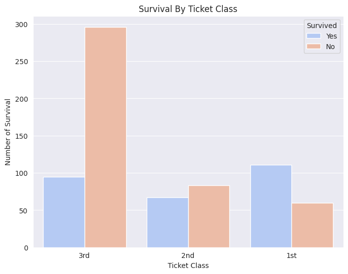
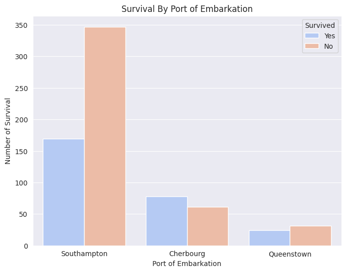
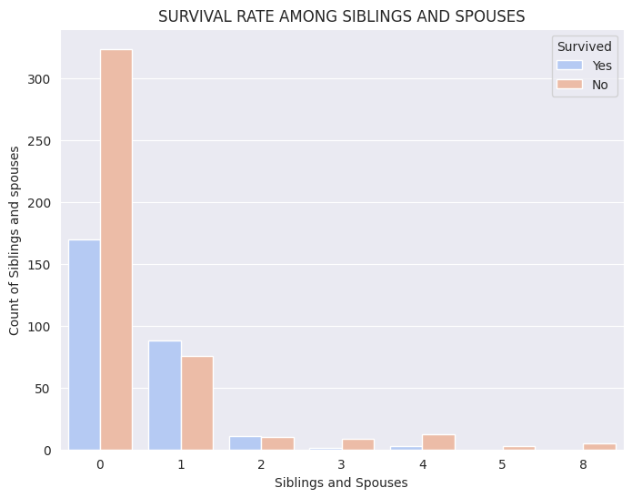
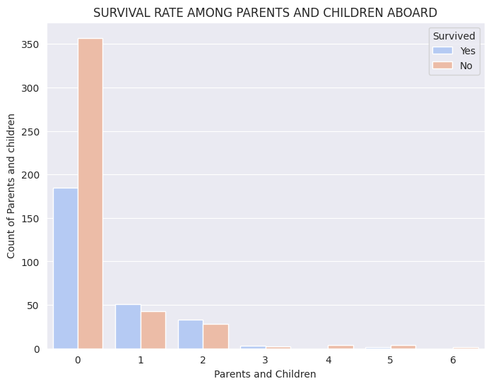
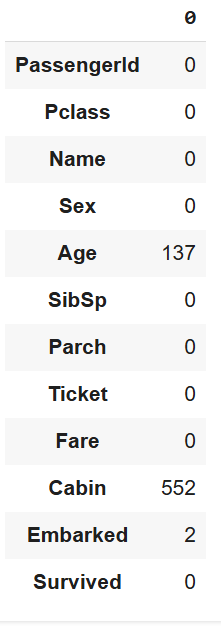
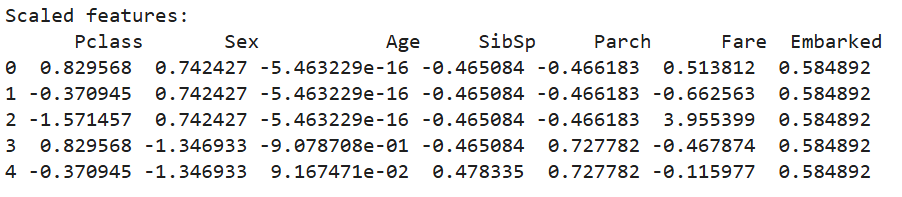
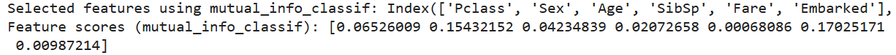
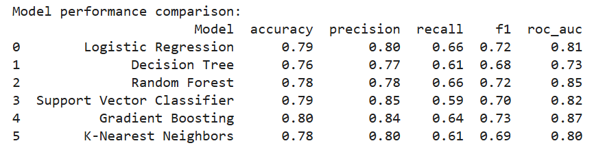
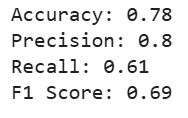

# Titanic Machine Learning Project: Final Report

## Objective
The objective of this project is to analyze and predict passenger survival during the Titanic disaster using machine learning models. This project demonstrates the complete ML pipeline, including data preprocessing, feature engineering, model evaluation, and optimization.

## Dataset
The Titanic dataset consists of features like:
- **Survival**: Target variable (0 = No, 1 = Yes)
- **Pclass**: Passenger class (1st, 2nd, 3rd)
- **Sex**: Gender of the passenger
- **Age**: Age of the passenger
- **SibSp**: Number of siblings/spouses aboard
- **Parch**: Number of parents/children aboard
- **Fare**: Ticket fare
- **Embarked**: Port of embarkation (C, Q, S)

### 1. Data Exploration and Visualization
- **Techniques**:
  - Summary statistics to understand central tendencies and variability.
  - Bar plots and histograms for visualizing survival trends across gender, age, and class.
- **Findings**:
  - Women had higher survival rates compared to men.
  

  - 1st class passengers were more likely to survive than those in 2nd or 3rd class.
  

  - Queenstown passengers had a higher survival rate compared to those from Cherbourg or Southampton.
  

  - Southampton was a key embarkation point for passengers, particularly those in the lower ticket classes.
  - Cherbourg attracted wealthier passengers in 1st class.
  - Queenstown primarily catered to 3rd-class passengers, indicating economic or geographic trends among the boarding points.

  

  - Passengers with lower family on board had the higher survival rate.
  

  

### 2. Data Cleaning and Preprocessing
- Missing values in the `Age`, `Embarked` and the `Cabin` Columns.
    
    

 - Handling missing values using mean imputation for `Age`, and mode imputation for `Embarked` and `Cabin`.
    

- Encoding categorical variables using Label encoding for `Pclass`,`Sex`,`Embarked`, and `Survived`.

- Dropping Irrelevant columns since it's correlation with the target variable `Survived` is very low.
    After dropping the columns, the dataset is reduced to **8** features.
    ['Pclass', 'Sex', 'Age', 'SibSp', 'Parch', 'Fare', 'Embarked',
       'Survived']

- Scaling the Features using StandardScaler to reduce the effect of feature scaling on the model.
    

### 3. Feature Engineering
- **Feature Selection**:
  - Retained features with high correlation to survival or importance from model analysis.
  - Using mutual information to select the most **6** informative features.
  

### 4. Model Training and Evaluation
- **Models Used**:
  - Logistic Regression
  - Random Forest Classifier
  - Support Vector Machine
  - Decision Tree Classifier
  - Gradient Boosting Classifier
  - K-Nearest Neighbors

- **Metrics**:
  - Accuracy
  - Precision, Recall, and F1-Score
  - ROC-AUC for classification quality

     

- **Results**:
  Gradient Boosting outperformed other models in accuracy before optimizing.

### 5. Model Optimization
- **Hyperparameter Tuning**:
  - GridSearchCV was used  to find the best model.

  

  - The optimized model `Decision Tree` achieved an accuracy of 81%.

### 6. Testing and Submission
- **Prediction**:
  - Final model was applied to the [test dataset](Data/test.csv) and acheived an accuracy of 78%.

  

  - Results were saved in a [submission](Data/Brempong_submission.csv) file format.

## Conclusion
The project demonstrated a comprehensive approach to machine learning, with Decision Tree emerging as the best model.

- The analysis reveals significant relationships between the port of embarkation and ticket class, highlighting the following key points:

`Economic Stratification:`
   - Southampton and Queenstown primarily served 3rd-class passengers, reflecting their roles as departure points for economically disadvantaged travelers.
    Cherbourg catered predominantly to wealthier 1st-class passengers, indicating its prominence among affluent communities.

`Class Inequality:`
 -  There was clear class stratification, with wealthier passengers embarking mostly from Cherbourg, while lower-class passengers dominated Southampton and Queenstown.

`Historical Implications:`
 - These disparities likely influenced survival outcomes during the Titanic disaster, as 1st-class passengers had greater access to safety measures, such as lifeboats, Hnece increasing their chance of survival.

## Appendix
- **Code**: [Attached in the Jupyter Notebook.](Notebook/Titanic.ipynb)
- **Visualizations**: Included in the notebook and the [Images directory](Images) for better understanding of trends.

